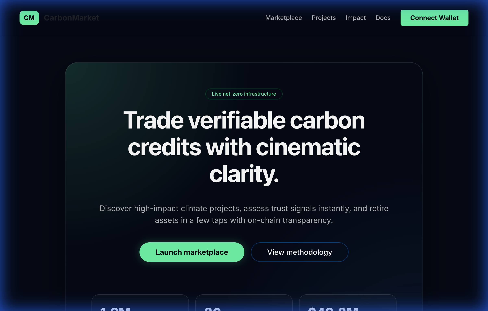
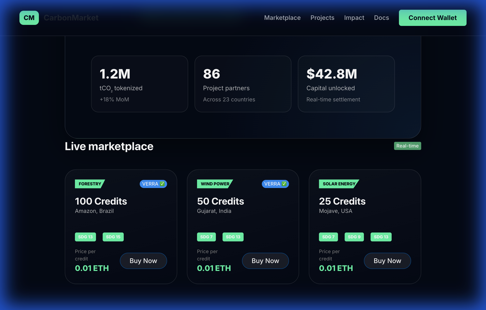

# StackHack 3.0 Submission: Problem Statement 3
## Project: Decentralized Carbon Credit Marketplace

**Theme**: Online Marketplace for Carbon Credits  
**Author**: Abhishek Kulkarni  
**GitHub Repository**: [Your Repo Link Here]  

---

## 🏆 Alignment with Problem Statement 3
This project delivers a high-performance, decentralized marketplace for carbon credits, explicitly meeting all "must-have" requirements of the PS3 prompt:

*   **Pricing**: Real-time ETH/Wei pricing displayed with 0.01 ETH decimals for precision.
*   **Categorization**: Projects are categorized into **Forestry**, **Wind Power**, and **Solar Energy**.
*   **Impact (SDGs)**: Every project card displays specific UN Sustainable Development Goal badges (SDG 7, 9, 13, 15) to verify climate impact.
*   **Verification**: Integrated **VERRA ✅** certification status and geographic verification (Location tracking).

---

## ✨ Features & Innovation

### 1. Web3 Tech Stack
- **Blockchain**: Local Ethereum node using **Hardhat**.
- **Smart Contracts**: ERC-1155 based carbon credit tokenization and Marketplace logic.
- **Frontend/Backend**: **Python-first stack** using **Reflex** (Next.js/FastAPI foundation).
- **Wallet Integration**: Native MetaMask connectivity via Ethers.js for secure trade execution.

### 2. "Cinematic Clarity" UI/UX
- **Glassmorphism Design**: A premium interface with blurred backgrounds and neon accents.
- **Micro-Interactions**: Smooth hover transformations and real-time syncing of marketplace listings.
- **Accessibility**: High-contrast typography and clear call-to-actions.

---

## 🌍 Deployed Prototype & References

As this is a **Decentralized Application (dApp)**, the prototype consists of:
1.  **Smart Contracts**: Deployed on a local Ethereum node (Hardhat).
2.  **Web Interface**: A Python-based Reflex application interacting with the blockchain.

### How to Run the Prototype for Evaluation:
To experience the full functionality (Trade Execution, Wallet Sync, On-chain Minting), please follow the **Running the Application** steps in the `README.md`. 

> [!TIP]
> The application uses a local RPC network at `http://localhost:8545`.

---

## 📸 Screenshots & Video

### 1. High-Impact Hero Section

### 2. Multi-Category Marketplace (PS3 Must-Haves)
Displays Categories, SDG Badges, and VERRA Verification status.

### 🎥 Demo Video
A full walkthrough of the application features and UI animations.
[Watch Demo Video](recordings/demo_video.webp)

---

## 🛠 Setup & Run Instructions
*(Please refer to the `README.md` for detailed commands)*

1.  **Dependencies**: Managed via `Poetry` and `NPM`.
2.  **Blockchain**: Run `npx hardhat node`.
3.  **Deployment**: Run `poetry run python marketplace_app/deploy_web3.py`.
4.  **Frontend**: Run `poetry run reflex run` inside `marketplace_app/`.
